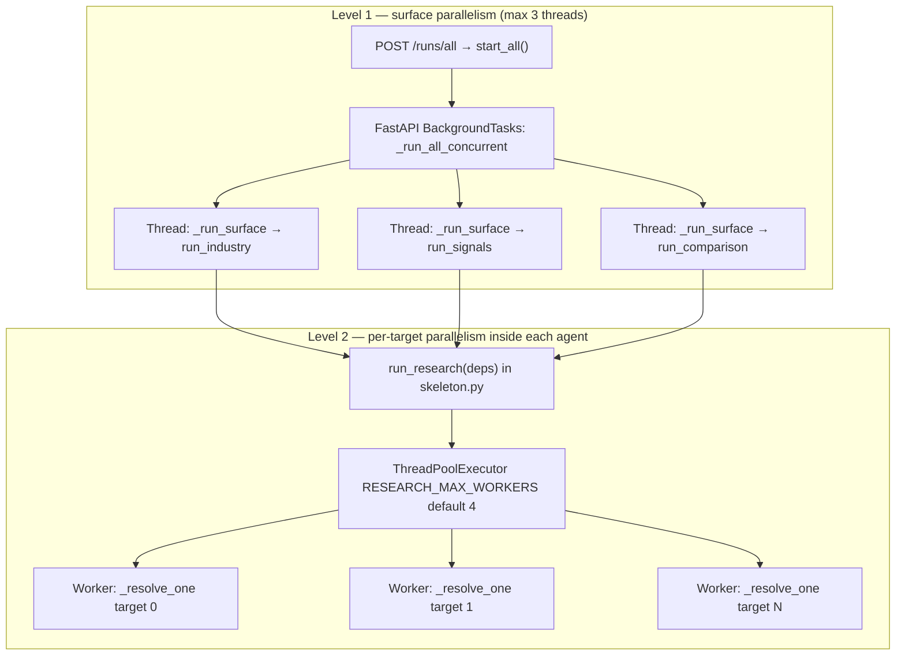
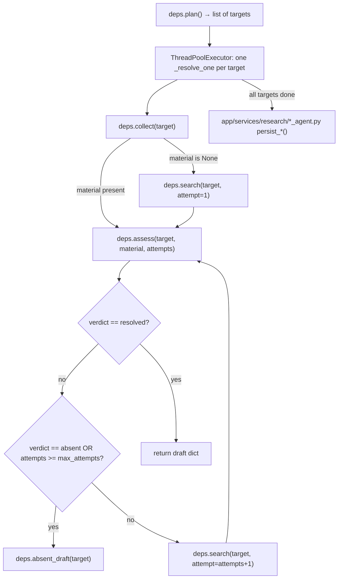

# Three research agents — orchestration

This document covers **only** the current surface research pipeline: Industry, Signals,
and Comparison agents running together via threads. It does **not** describe the legacy
`interpret` graph or the separate `run_collection` / `run_scoring` cron jobs (those feed
RSS/API captures and re-score existing signals — they are not the three agents).

## Entry points

| Trigger | HTTP | Controller | What runs |
|---|---|---|---|
| **Run now** (all pages) | `POST /runs/all` | `start_all()` | Three agents in parallel |
| **Run this page** | `POST /runs` `{ "kind": "industry" \| "signals" \| "comparison" }` | `start_surface_run()` | One agent |
| Tests / direct call | — | `worker.jobs.run_industry` / `run_signals` / `run_comparison` | Same agent functions |

Router: `backend/app/routers/runs.py`  
Controller: `backend/app/controllers/runs.py`

## Threading model (two levels)

**Level 1** (`_run_all_concurrent`): one `ThreadPoolExecutor(max_workers=3)` runs
`_run_surface` for each surface. Each surface gets its own `run_id`, shared `batch_id`,
and independent status in the in-memory run store. One surface failing does not stop the
others — errors are caught inside `_run_surface`.

**Level 2** (`run_research`): after `deps.plan()`, every target (bucket, competitor×sub-type,
or comparison cell) resolves concurrently in a bounded pool (`RESEARCH_MAX_WORKERS`, default
`4`). Draft order matches `plan()` order. **Persistence is serial** on the caller's DB session
after all targets finish — threads never share a SQLAlchemy session during writes.

**Signals-only extra threading:** structured `collect()` opens its own `SessionLocal()` per
call when no shared session is passed, so parallel skeleton workers can query Lever/Greenhouse/OSV
without sharing ORM state.

## Shared skeleton (all three agents)

Every agent implements the `ResearchDeps` protocol and delegates target resolution to
`agent/graphs/research/skeleton.py::run_research`:

Key functions:

| Function | File | Role |
|---|---|---|
| `run_research` | `backend/agent/graphs/research/skeleton.py` | Plans targets, parallel resolve, returns drafts |
| `_resolve_one` | same | Per-target collect → search → assess loop (max 3 attempts) |
| `broaden_query` | `backend/agent/graphs/research/query.py` | Appends broader suffixes on retry attempts 2/3 |
| `source_url_grounded` / `hit_urls` | `backend/agent/graphs/research/grounding.py` | Gate output URLs must appear in search hits |
| `web_search` | `backend/agent/tools/web_search.py` | OpenAI Responses API + `web_search` tool → `SearchHit[]` |
| `record_finding` | `backend/app/services/research/provenance.py` | Synthetic capture under `*_research` source |
| `index_finding` | same | Embeds text into `chunk` table for Ask RAG |

## Progress reporting

`make_reporter(run_id, surface)` in `runs.py` maps skeleton progress keys to human labels
from `config/surface_steps.yaml`:

| Progress key | When called |
|---|---|
| `plan` | After `deps.plan()`, before target pool |
| `research` | After each target completes (`completed of total`) |
| `writing` | Before `persist_*` |
| `saving` | During DB commit path |

## Per-agent deep dives

| Agent | Doc | Targets | DB output |
|---|---|---|---|
| Industry | [industry-agent-pipeline.md](./industry-agent-pipeline.md) | 4 buckets from `industry_buckets.yaml` | `Signal` + `SignalEvidence` on `industry` entity |
| Signals | [signals-agent-pipeline.md](./signals-agent-pipeline.md) | 5 competitors × 4 sub-types = 20 targets | `Signal` + `SignalEvidence` per competitor |
| Comparison | [comparison-agent-pipeline.md](./comparison-agent-pipeline.md) | 5 competitors × 5 dimensions = 25 cells | `Claim` + `Evidence` (subject=jfrog) |

## What is NOT these agents

| Path | Purpose |
|---|---|
| `worker/jobs.py::run_collection` | Parallel RSS/API/snapshot fetch into `RawCapture` (cron / manual collect) |
| `worker/jobs.py::run_scoring` | Recomputes materiality scores on existing `Signal` rows |
| Legacy `interpret` graph | Removed for surface pages; do not conflate with research agents |

The Signals agent **reuses** structured adapters (Lever, Greenhouse, OSV) at research time;
it does not depend on a prior `run_collection` pass for those sub-types.
