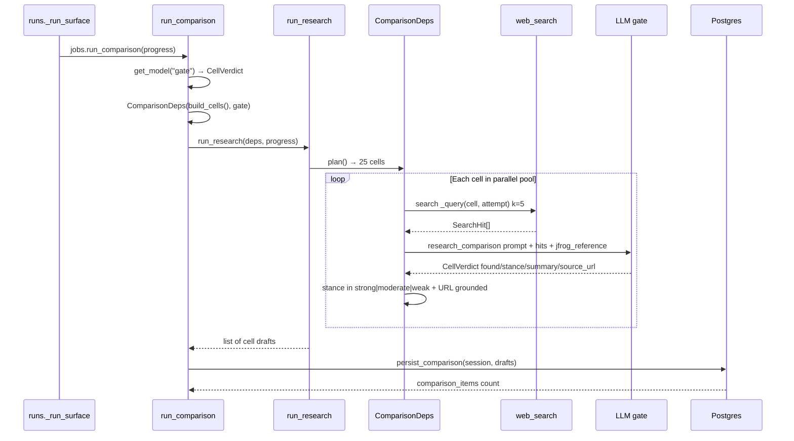
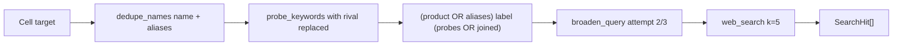
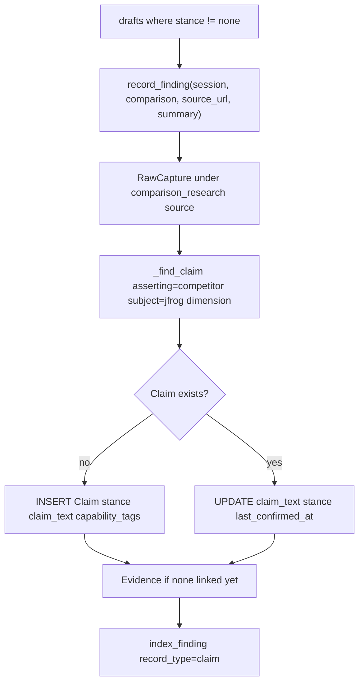

# Comparison agent — pipeline flow

**Scope:** Competitor × capability matrix (25 cells). Runs inside the three-agent thread
pool (see [00-three-agent-orchestration.md](./00-three-agent-orchestration.md)).

Each cell resolves to a **stance** (`strong` | `moderate` | `weak`) backed by a sourced
summary, or `none` when no public claim is found.

## Activation order



## Target planning

**Functions:** `build_cells()` → `comparison_agent.py`; `ComparisonDeps.plan()` → `comparison/deps.py`

| Config file | Loader |
|---|---|
| `config/competitors.yaml` + `entities.yaml` | `load_competitors()` |
| `config/comparison_dimensions.yaml` | `load_dimensions()` in `comparison_matrix.py` |

**25 cells** = 5 competitors × 5 dimensions. Each target:

```python
{
  "competitor": "sonatype",      # slug
  "name": "Sonatype",
  "aliases": [...],
  "dimension": "sca_sbom",       # key
  "label": "SCA / SBOM",         # human label
  "probe_keywords": ["<rival> SCA", ...],
  "jfrog_reference": "Xray + AppTrust — ..."
}
```

Comparison is **search-first**: `collect()` returns `None`.

## Information gathering



**Function:** `ComparisonDeps._query()` → `comparison/deps.py`

Example base query shape:

```
(Sonatype OR ...) SCA / SBOM (Sonatype SCA OR SBOM generation OR dependency scanning)
```

## LLM gate — what gets injected

**Function:** `ComparisonDeps.assess()` → `backend/agent/graphs/research/comparison/deps.py`

1. Prompt: `agent/prompts/research_comparison.md`
2. JSON **DATA** payload:

```json
{
  "competitor": "Sonatype",
  "aliases": ["..."],
  "dimension": "SCA / SBOM",
  "jfrog_reference": "Xray + AppTrust — SCA with contextual analysis...",
  "hits": [{"title", "url", "snippet"}]
}
```

3. Structured output: `CellVerdict` — `found`, `stance`, `summary`, `source_url`
4. Resolve when:
   - `found == true`
   - `stance in {strong, moderate, weak}`
   - `source_url` grounded in search hits (`source_url_grounded()`)
5. Else `unresolved` → skeleton retries with broadened query (up to 3 attempts)

## Draft shapes

**Resolved:**

```python
{
  "competitor": "sonatype",
  "dimension": "sca_sbom",
  "stance": "strong",           # or moderate / weak
  "summary": "One-line sourced verdict",
  "source_url": "https://..."
}
```

**Absent / no public claim:**

```python
{
  "competitor": "sonatype",
  "dimension": "sca_sbom",
  "stance": "none"
}
```

Cells with `stance == "none"` are **not written** to the database on persist.

## Persistence to database

**Functions:** `persist_comparison()` → `comparison_agent.py`; `run_comparison()` commits
via `SessionLocal()`.



| Table | Content |
|---|---|
| `claim` | `subject_entity_id` = jfrog; `asserting_entity_id` = competitor; `dimension`; `stance`; `claim_text` = summary |
| `claim.claim_type` | `"positioning"` |
| `claim.capability_tags` | `[dimension key]` |
| `evidence` | Links claim ↔ capture; quote = summary |
| `raw_capture` | Synthetic source `comparison_research`; real URL on `blob_path` |
| `chunk` | Embedded summary; `record_type="claim"`; `signal_type="positioning_messaging"` |

**Upsert logic:** `_find_claim()` matches `(asserting_entity_id, subject_entity_id=jfrog, dimension)`.
Existing claims get updated text/stance/timestamp; evidence row added only if missing.

## API consumption (after persist)

`GET /comparison/matrix` reads `Claim` + `Evidence` via `build_comparison_matrix()` —
not part of the agent run, but shows how persisted rows surface to the UI.

## Return value

`run_comparison()` → `{"comparison_items": n}` — count of claims written/updated (non-`none` cells).

## Function index

| Function | Path |
|---|---|
| `run_comparison` | `backend/app/services/research/comparison_agent.py` |
| `build_cells` / `persist_comparison` / `_find_claim` | same |
| `ComparisonDeps` | `backend/agent/graphs/research/comparison/deps.py` |
| `load_dimensions` | `backend/app/services/comparison_matrix.py` |
| `load_competitors` | `backend/app/services/research/competitors.py` |
| `record_finding` / `index_finding` | `backend/app/services/research/provenance.py` |
| `run_research` | `backend/agent/graphs/research/skeleton.py` |
| `web_search` | `backend/agent/tools/web_search.py` |
