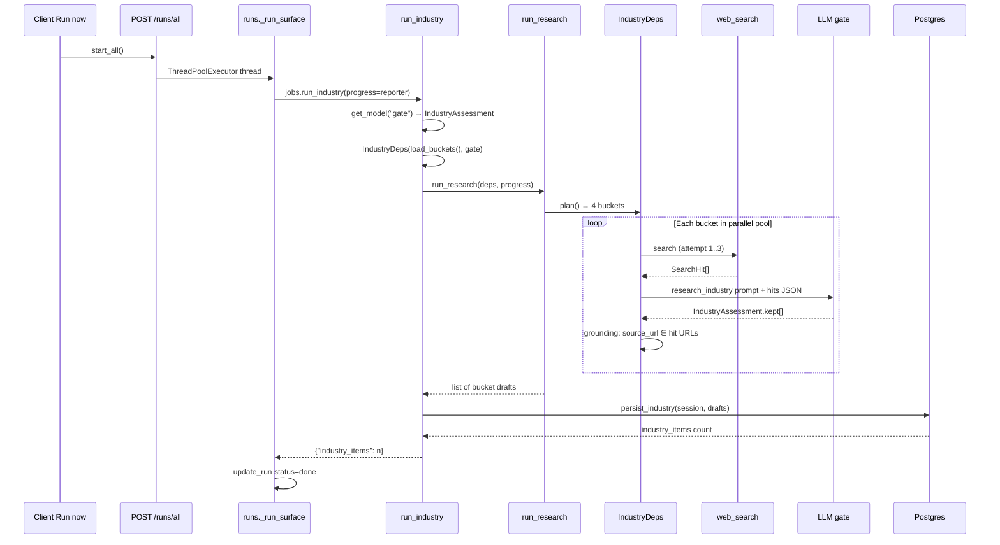
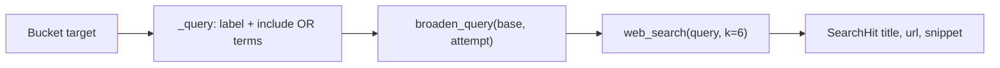
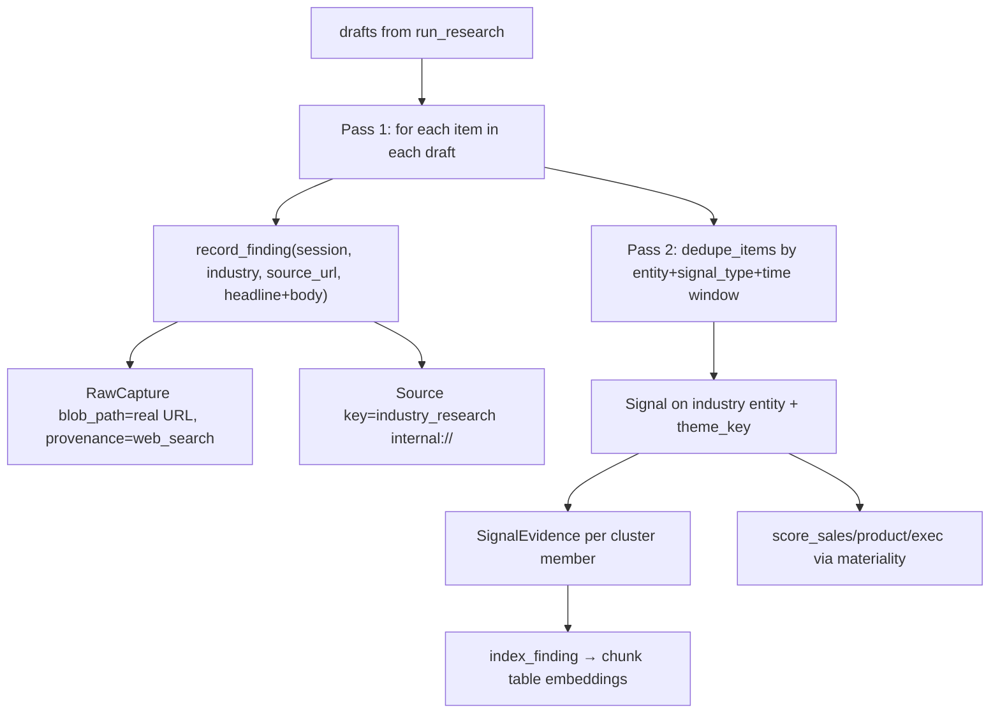

# Industry agent — pipeline flow

**Scope:** DevSecOps industry buckets only. Runs inside the three-agent thread pool
(see [00-three-agent-orchestration.md](./00-three-agent-orchestration.md)).

## Activation order



## Target planning

**Function:** `IndustryDeps.plan()` → `backend/agent/graphs/research/industry/deps.py`

Returns the four buckets from `config/industry_buckets.yaml` via `load_buckets()` in
`backend/app/services/research/industry_agent.py`. Each target dict carries:

| Field | Source | Used for |
|---|---|---|
| `key` | bucket key | `Signal.theme_key`, draft `bucket` |
| `label` | human label | web search query |
| `include` / `exclude` | keyword lists | injected into LLM gate payload |
| `signal_type` | e.g. `security_trust` | `Signal.signal_type` |

Industry is **search-first**: `collect()` always returns `None`, so every bucket goes
straight to web search on attempt 1.

## Information gathering



| Step | Function | File |
|---|---|---|
| Build query | `IndustryDeps._query()` | `industry/deps.py` |
| Broaden on retry | `broaden_query()` | `query.py` |
| Live search | `web_search()` → `WebSearch.search()` | `web_search.py` |
| Extract citations | `_extract_results()` | `web_search.py` |

Retry broadening (attempts 2–3): appends fixed suffixes from `query.py` — never repeats
the identical query verbatim.

## LLM gate — what gets injected

**Function:** `IndustryDeps.assess()` → `industry/deps.py`

1. Loads system prompt: `agent/prompts/research_industry.md` via `prompt("research_industry")`
2. Appends JSON **DATA** payload:

```json
{
  "bucket": "<key>",
  "include": ["malicious package", "..."],
  "exclude": ["data breach unrelated to packages"],
  "hits": [{"title": "...", "url": "...", "snippet": "..."}]
}
```

3. Invokes `gate_model.with_structured_output(IndustryAssessment)` — Pydantic schema
   `IndustryItem`: `headline`, `body`, `why_it_matters`, `source_url`
4. **Grounding:** filters `kept` items where `source_url` appears in search hit URLs
   (`hit_urls()` in `grounding.py`)
5. Returns `("resolved", draft)` if any items kept; else `("unresolved", None)` → skeleton retries search

## Per-bucket draft shape

**Resolved:**

```python
{
  "bucket": "supply_chain_vulns",
  "signal_type": "security_trust",
  "items": [
    {"headline", "body", "why_it_matters", "source_url"},
    ...
  ]
}
```

**Absent (empty bucket):**

```python
{"bucket": "...", "signal_type": "...", "items": []}
```

## Persistence to database

**Function:** `persist_industry()` → `backend/app/services/research/industry_agent.py`  
**Entry:** `run_industry()` opens `SessionLocal()`, calls `persist_industry`, `session.commit()`



| Table | What is written |
|---|---|
| `source` | Synthetic `industry_research` (`internal://industry_research`) — created once by `agent_source()` |
| `raw_capture` | One per item; `blob_path` = real web URL; `extracted_text` = headline + body |
| `signal` | One per deduped event cluster; `theme_key` = bucket; `why_it_matters`, scores |
| `signal_evidence` | Links signal ↔ capture; `match_method="synthesis"` |
| `chunk` | Vector index via `index_finding(record_type="signal", ...)` for Ask RAG |

**Dedup:** `dedupe_items()` in `dedup.py` merges near-duplicate headlines within the same
`(entity_slug, signal_type, time-window)` bucket; corroboration count = cluster size.

## Return value

`run_industry()` → `{"industry_items": n}` where `n` = number of `Signal` rows written.
Controller maps this to run progress `new_items` via `_new_items_from_report()`.

## Function index

| Function | Path |
|---|---|
| `start_all` / `_run_surface` | `backend/app/controllers/runs.py` |
| `run_industry` | `backend/app/services/research/industry_agent.py` |
| `load_buckets` | same |
| `persist_industry` | same |
| `run_research` / `_resolve_one` | `backend/agent/graphs/research/skeleton.py` |
| `IndustryDeps` | `backend/agent/graphs/research/industry/deps.py` |
| `record_finding` / `index_finding` | `backend/app/services/research/provenance.py` |
| `dedupe_items` | `backend/app/services/research/dedup.py` |
| `web_search` | `backend/agent/tools/web_search.py` |
| `get_model("gate")` | `backend/agent/llm.py` |
