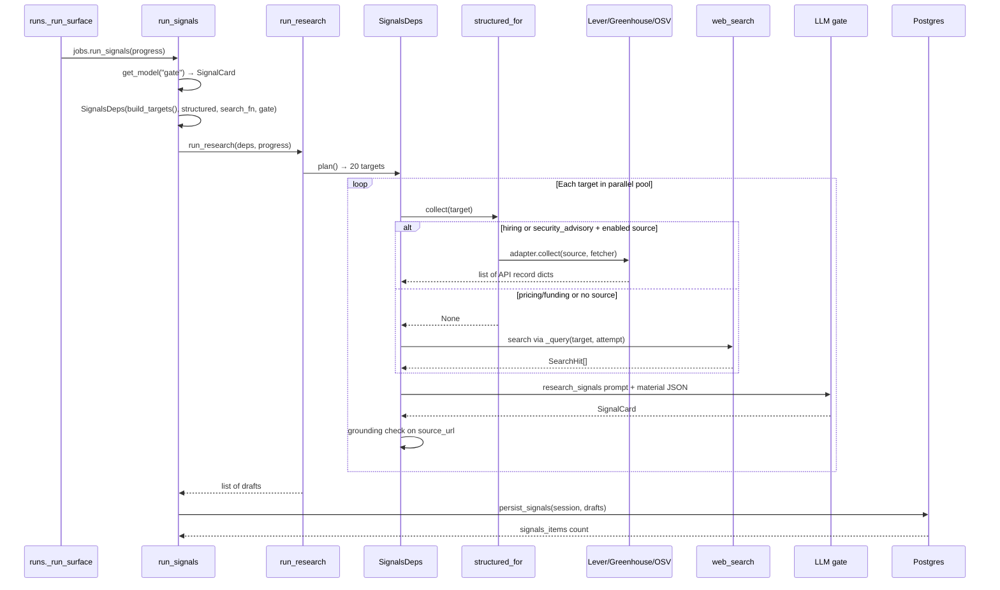
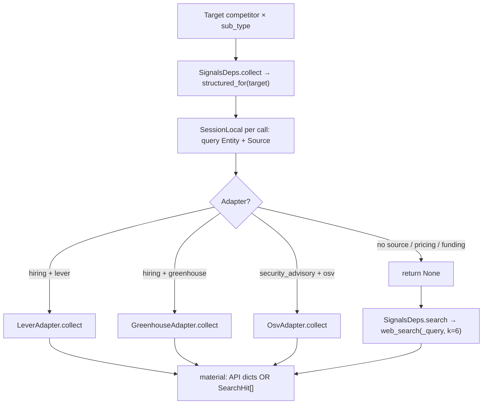
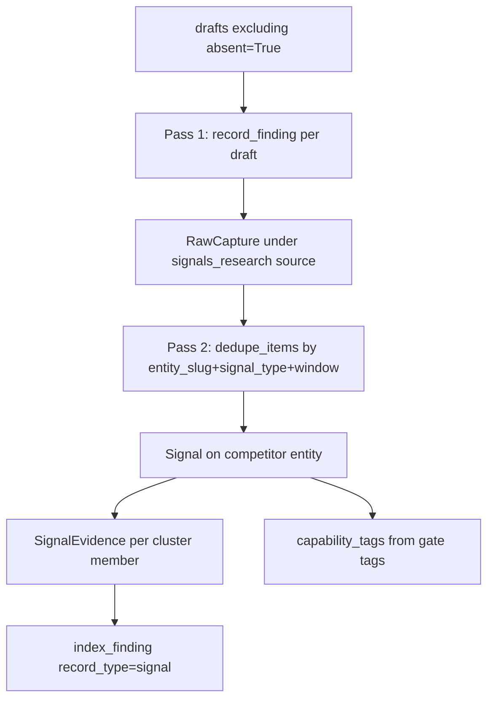

# Signals agent — pipeline flow

**Scope:** Competitor signals (hiring, pricing, funding, security advisories). Runs inside
the three-agent thread pool (see [00-three-agent-orchestration.md](./00-three-agent-orchestration.md)).

Unlike Industry and Comparison, Signals uses a **tiered collect path**: structured API/ATS/OSV
sources first, then web search fallback.

## Activation order



## Target planning

**Functions:** `build_targets()` → `signals_agent.py`; `SignalsDeps.plan()` → `signals/deps.py`

| Input config | Function |
|---|---|
| `config/competitors.yaml` | allowlist slugs |
| `config/entities.yaml` | names + aliases via `load_competitors()` |

**20 targets** = 5 competitors × 4 sub-types:

| sub_type | signal_type (DB) | Structured collect? |
|---|---|---|
| `hiring` | `talent_org` | Yes — Lever or Greenhouse `Source` on entity |
| `pricing` | `pricing_packaging` | No — web search only |
| `funding` | `corporate_financial` | No — web search only |
| `security_advisory` | `security_trust` | Yes — OSV adapter on entity |

Each target dict: `{competitor, name, aliases, sub_type, signal_type}`.

## Information gathering — tiered flow



### Structured collect (thread-safe)

**Functions:** `structured_for()` → `_structured_collect()` → `signals_agent.py`

- Production: `structured_for()` with **no session** — each parallel worker opens its own
  `SessionLocal()` inside `collect()`
- Queries `Entity` by competitor slug, finds enabled `Source` with matching `adapter`
- Converts adapter records via `_api_record_to_dict()` → `{external_id, title, body, occurred_at, url, extra}`

### Web search fallback

**Function:** `_query()` → `signals_agent.py` (injected as `search_fn` into `SignalsDeps`)

| sub_type | Query pattern |
|---|---|
| hiring | `{name} careers {aliases} enterprise sales OR security engineer` |
| pricing | `{name} pricing plans per-seat` |
| funding | `{name} funding round OR acquisition 2026` |
| security_advisory | `{name} {aliases} security advisory CVE vulnerability` |

Broadened on retry via `broaden_query()` in `query.py`.

## LLM gate — what gets injected

**Function:** `SignalsDeps.assess()` → `backend/agent/graphs/research/signals/deps.py`

1. Prompt: `agent/prompts/research_signals.md`
2. JSON **DATA** payload:

```json
{
  "competitor": "Sonatype",
  "aliases": ["..."],
  "sub_type": "hiring",
  "material": [
    {"title", "url", "snippet"}           // SearchHit path
    // OR
    {"external_id", "title", "body", "url", ...}  // structured path
  ]
}
```

3. Structured output: `SignalCard` — `usable`, `headline`, `so_what`, `why_it_matters`,
   `tags`, `source_url`
4. Resolve when: `usable && source_url && why_it_matters`
5. **Grounding:**
   - Web-search material: `source_url_grounded()` — URL must be in hit list
   - Structured material: grounding **skipped** (`hit_urls()` returns `None` → grounded=True)

## Draft shapes

**Resolved:**

```python
{
  "competitor": "sonatype",
  "signal_type": "talent_org",
  "headline": "...",
  "so_what": "...",
  "why_it_matters": "...",
  "tags": ["..."],
  "source_url": "https://..."
}
```

**Absent:**

```python
{"competitor": "...", "sub_type": "...", "absent": True}
```

Absent drafts are **skipped** in `persist_signals()` (`if draft.get("absent"): continue`).

## Persistence to database

**Functions:** `persist_signals()` → `signals_agent.py`; called inside `run_signals()` on one
`SessionLocal()` session (serial writes after parallel research).



| Column / table | Content |
|---|---|
| `signal.entity_id` | Competitor entity (not industry) |
| `signal.signal_type` | Mapped from sub_type |
| `signal.headline` | Gate output |
| `signal.so_what_*` | Same `so_what` for sales/product/exec |
| `signal.why_it_matters` | Gate output |
| `signal.capability_tags` | Gate `tags` |
| `signal.cluster_key` | SHA256 of `{slug}:{signal_type}:{headline}` |
| `raw_capture.blob_path` | Real source URL (ATS job page, OSV advisory, or web hit) |
| `chunk` | Embedded `so_what` text for Ask |

Materiality scores computed via `score()` in `materiality.py` at persist time.

## Return value

`run_signals()` → `{"signals_items": n}` — count of new `Signal` rows after dedup.

## Function index

| Function | Path |
|---|---|
| `run_signals` | `backend/app/services/research/signals_agent.py` |
| `build_targets` / `_query` / `_structured_collect` | same |
| `structured_for` | same |
| `persist_signals` | same |
| `SignalsDeps` / `_as_json` | `backend/agent/graphs/research/signals/deps.py` |
| `source_url_grounded` / `hit_urls` | `backend/agent/graphs/research/grounding.py` |
| `LeverAdapter` / `GreenhouseAdapter` / `OsvAdapter` | `backend/app/services/collection/apis/` |
| `load_competitors` | `backend/app/services/research/competitors.py` |
| `run_research` | `backend/agent/graphs/research/skeleton.py` |
